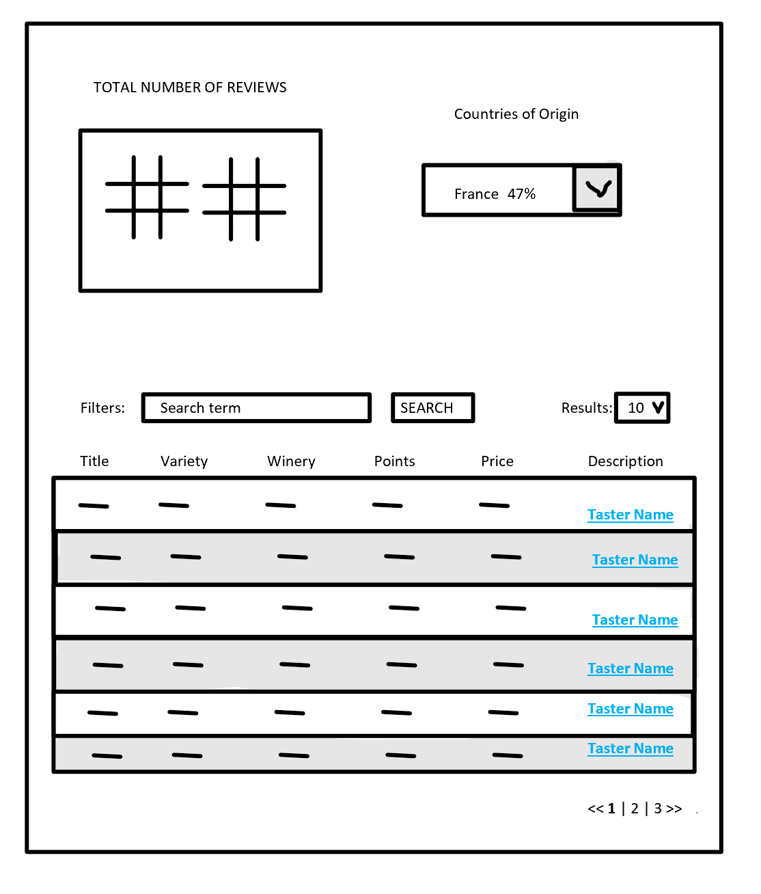

# Overview

1. Spend no more than 4.0 hours on this assessment. We are evaluating both the skill level of building a web app in addition to the quality within a tight timeline. Complete as much as you can within the allotted time. 
2. Commit often to track progress. Keep commit messages informative.
3. Make an initial commit of an empty file with your name and start time commented on the top to start the time. 
3. Publish your code to GitHub and publish your final app to GH Pages (or if you prefer to another host)

## Requirements

Using the data that you receive from this GET request `https://lightninglaw.azurewebsites.net/api/reviews` to complete the following tasks:

1. Create a single page application that matches the provided wireframe
2. Ensure that the data on the page is functional when a different country is chosen from the top right country dropdown.
3. The data should persist upon page refresh
3. The total number of reviews is the is the total number that the specific country has total.
4. The search term will filter on Title, Variety, Winery, or Taster's Name.
5. Publish your final code to a GitHub repository, as well as to GitHub Pages.

Your code will be evaluated by both the CTO and lead Frontend developer. After a thorough review, you may be asked to return for a follow up interview to discuss your process and implementation. 

## Wireframe

